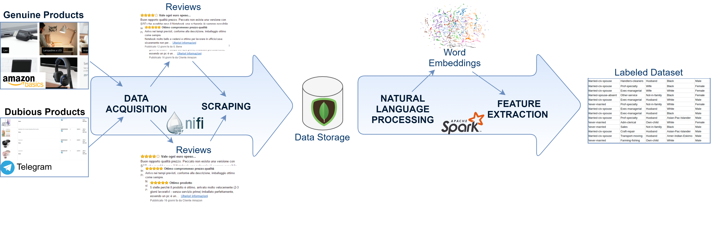

# Unmask inflated product reviews through Machine Learning

2021 IEEE International Conference on Computational Intelligence and Virtual Environments for Measurement Systems and Applications (CIVEMSA) · 27 jul. 20212021 IEEE International Conference on Computational Intelligence and Virtual Environments for Measurement Systems and Applications (CIVEMSA) · 27 jul. 2021

This work presents a Big Data oriented framework implementing dubious product detection based on the evaluation of their reviews. The framework produces an alert for the user regarding the low level of trustworthiness of a product. Such information could help the user to filter out dubious products or products sold by fraudulent vendors.

It focuses on the analysis of two review data streams of Amazon products: The first one is composed of the reviews corresponding to the products in the AmazonBasics category. The latter collects reviews of the products in the Telegram channels known for giving products for free in exchange for 5-star reviews. The analysis reveals a substantial dissimilarity between the two sources of reviews, that conducts to the construction of a ground truth dataset employed in the machine learning classification model training. The classification activity can assist during product rating interpretation, which could be invalidated by too many fake reviews. The experimental results reveal that 1&2-star reviews are good predictors of the review’s trustworthiness and the product itself. In the future, it will be necessary to enlarge the analysis by also including reviews coming from countries differentfrom Italy.

Labeled dataset construction workflow:

For more information about the methodology and performances refer to the papaer [Unmask inflated product reviews through Machine Learning](https://ieeexplore.ieee.org/document/9493576).

In this repository you will find the application used for the scraping of comments implemented with Apache NiFi and a Jupyter Notebook with some EDA of the generated dataset, and the diferent models performances.
